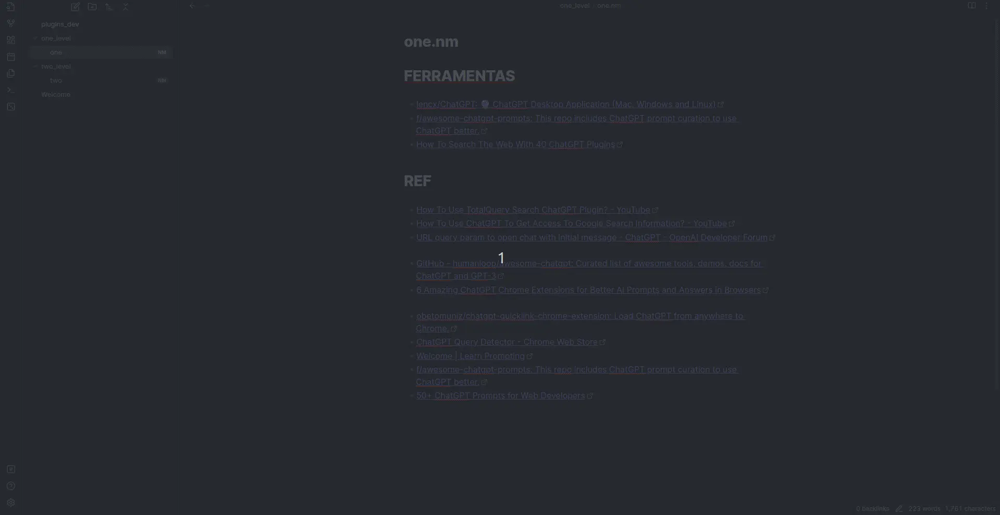

<a name="TOC"></a>

<h3 align="center">
  OBSIDIAN NOTES MANAGER
</h3>

<div align="center">
  <a href="https://nodejs.org/en/"></a>
  <a href="https://github.com/lucasvtiradentes/obsidian-notes-manager#contributing"></a>
</div>

<p align="center">
  <a href="#dart-features">Features</a> • <a href="#warning-requirements">Requirements</a> • <a href="#bulb-usage">Usage</a> • <a href="#wrench-development">Development</a> • <a href="#books-about">About</a>
</p>

<a href="#"></a>

## :trumpet: Overview

<div align="center">manage and convert your notes from markdown to json and table.</div><br />

<div align="center">
  
</div>


## :question: Motivation

I made this because most of my notes contains only links in markdown format grouped by theme and it would be great to view them in a table/json format.

## :dart: Features<a href="#TOC"></a>

&nbsp;&nbsp;&nbsp;✔️ convert your notes to markdown, table and json;<br>
&nbsp;&nbsp;&nbsp;✔️ custom settings to setup table columns and json keys.<br>

## :warning: Requirements<a href="#TOC"></a>

In order to use this project in your computer, you need to have the following item:

- [obsidian](https://obsidian.md/): To actually run the plugin.

## :bulb: Usage<a href="#TOC"></a>

In order to use this plugin you have two options:

a) clone this repository and place it on the `~/.obsidian/plugins` folder.

b) install this plugin from the directly from the `community plugins` on obsidian, by searching for "notes manager".

## :wrench: Development<a href="#TOC"></a>

### Development setup

To setup this project in your computer, download it in this link or run the following commands:

```bash
# Clone this repository
$ git clone https://github.com/lucasvtiradentes/obsidian-notes-manager

# Go into the repository
$ cd obsidian-notes-manager
```

After download it, go to the project folder and run these commands:

```bash
# Install dependencies using npm
$ npm install

# Run the typescript code in development mode
$ npm run dev
```

### Used technologies

This project uses the following thechnologies:

<div align="center">
  <table>
    <tr>
      <th>Scope</th>
      <th>Subject</th>
      <th>Technologies</th>
    </tr>
    <tr>
      <td rowspan="1">Project</td>
      <td>Main</td>
      <td align="center">
        <a href="https://nodejs.org/"></a>
        <a target="_blank" href="https://www.typescriptlang.org/"></a>
      </td>
    </tr>
    <tr>
      <td rowspan="3">Setup</td>
      <td>Code linting</td>
      <td align="center">
        <a href="https://github.com/prettier/prettier"></a>
        <a href="https://github.com/eslint/eslint"></a>
      </td>
    </tr>
    <tr>
      <!-- <td rowspan="3">Setup</td> -->
      <td>Commit linting</td>
      <td align="center">
      <a target="_blank" href="https://github.com/conventional-changelog/commitlint"></a>
      <a target="_blank" href="https://github.com/commitizen/cz-cli"></a>
      <!-- <a href="https://gitmoji.dev"></a> -->
      </td>
    </tr>
    <tr>
      <!-- <td rowspan="1">Setup</td> -->
      <td>Other</td>
      <td align="center">
        <a href="https://editorconfig.org/"></a>
        <a target="_blank" href="https://github.com/typicode/husky"></a>
        <!-- <a target="_blank" href="https://github.com/okonet/lint-staged"></a> -->
      </td>
    </tr>
  </table>
</div>

<a href="#"></a>

## :books: About<a href="#TOC"></a>

## License

This project is distributed under the terms of the MIT License Version 2.0. A complete version of the license is available in the [LICENSE](LICENSE) file in this repository. Any contribution made to this project will be licensed under the MIT License Version 2.0.

<a href="#"></a>

<div align="center">
  <p>
    <a target="_blank" href="https://www.linkedin.com/in/lucasvtiradentes/"></a>
    <a target="_blank" href="mailto:lucasvtiradentes@gmail.com"></a>
    <a target="_blank" href="https://discord.com/users/262326726892191744"></a>
  </p>
  <p>Made with ❤️ by <strong>Lucas Vieira</strong></p>
  <p>👉 See also all <a href="https://github.com/lucasvtiradentes/lucasvtiradentes/blob/master/portfolio/PROJECTS.md#TOC">my projects</a></p>
  <p>👉 See also all <a href="https://github.com/lucasvtiradentes/my-tutorials#readme">my articles</a></p>
</div>